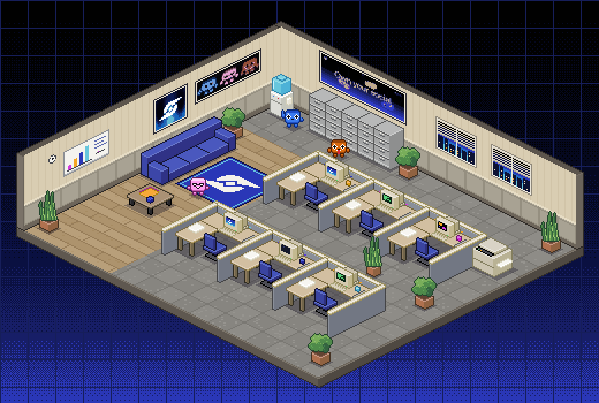

# Dlicom Pixel Office

Top-down 2.5D isometric pixel-art office in a 16-bit SNES style: retro cubicles,
beige CRT monitors, filing cabinets, a water cooler in the corner and green house
plants on a clean grid, in muted grey/beige with Dlicom brand accents.



## Brand assets used

Everything is generated from the files in [`brand/`](brand/):

| Source | Where it shows up |
| --- | --- |
| `dlicom-logo.png` | Framed wall poster, the white mark on the lounge rug, the diamond on CRT screens |
| `dlicom-banner.png` | "Own your social" poster above the filing cabinets |
| `dlicom-mascots.png` | Mascot poster on the wall, plus pixel re-draws of Blue, Pink and Orange walking around the office |

Brand colours (black, navy, blue `#2a37b7`, royal `#246dc5`, cyan `#67c6dd`,
violet, magenta, orange, cream) are sampled from those images and live in
`tools/assets.py`. They're used for the background gradient, the rug, window
skylines, the couch, chairs and the accents on each cubicle.

## Output (`dist/`)

| File | What |
| --- | --- |
| `office_scene.png` / `office_scene@4x.png` | Full scene on a brand gradient (native 520×350, and 4× nearest-neighbour) |
| `office_scene_transparent.png` | Scene on a transparent background |
| `tileset.png` / `tileset@3x.png` | Every piece packed onto one sheet |
| `tileset.json` | Atlas: frame rects plus the world-origin anchor for each piece |
| `tiles/*.png` | Each piece as its own PNG |
| `index.html` | Gallery page (open it directly in a browser) |

Projection: 2:1 isometric, 1 tile = 32×16 px (16 world units). A frame's
`anchor` is the pixel where the tile's back corner at floor level sits, so to
place a piece at tile `(tx, ty)`, draw it at
`(ox + (tx - ty) * 16 - anchor.x, oy + (tx + ty) * 8 - anchor.y)`.

## Rebuild

```sh
uv run python tools/build.py
```

Output is deterministic (seeded). `tools/iso.py` is the tiny renderer (boxes,
plane-mapped textures, depth sort), `tools/assets.py` has the palette, sprites and
textures, `tools/objects.py` has the furniture, and `tools/build.py` lays out
the room and packs the tileset.
